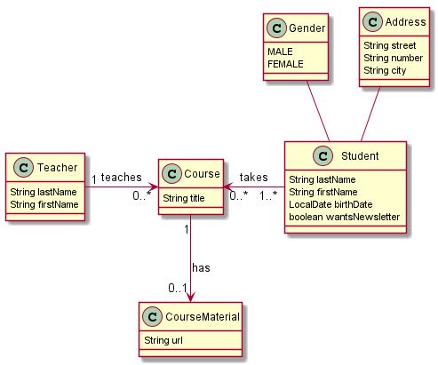

# Data JPA demo
### Running MongoDB demo
1. Start Docker in your machine.
2. Run `docker compose up -d`.
3. Run the app main class `com.example.demo.DemoApplication` with active profile `mongo`.

### DemoRelationsApplication data model
Referenced from this lesson https://stackabuse.com/a-guide-to-jpa-with-hibernate-relationship-mapping/
